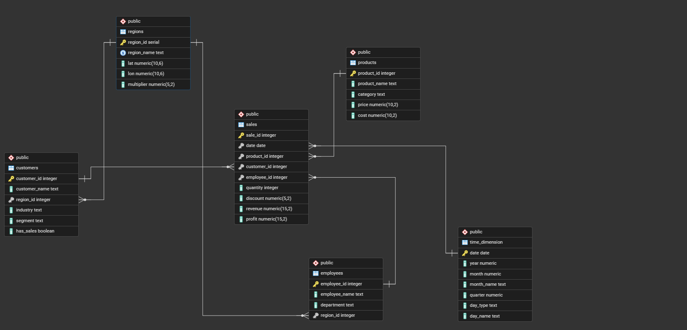

# 🧠 Enterprise Sales & Workforce Intelligence System 🚀

An end-to-end data pipeline and SAP-focused BI solution that simulates a real-world enterprise environment. This project demonstrates how raw data is transformed into actionable business insights using modern data engineering and professional BI tools.

---

## 🖼️ Data Architecture (The Snowflake Schema)
To ensure high data integrity and minimal redundancy, the backend was architected using a **Snowflake Schema**. This design supports complex enterprise relationships and high-performance analytical modeling.

---

## ⚙️ Architecture & Pipeline Flow
1. **Data Generation (Python):** 22,000+ validated records.
2. **Data Storage:** PostgreSQL Data Warehouse.
3. **Modeling:** SQL Semantic Layer (Views + KPIs).
4. **Visualization:** SAP Analytics Cloud (SAC) Dashboards.

---

## 🖼️ SAP Analytics Cloud Dashboards

### 📊 Executive Strategic Overview
*Focus: Revenue, Profit, Margin %, Regional Geo-Analysis, and Customer Segmentation.*

### 📈 Product & Seasonality Intelligence
*Focus: Top-performing products, Volume vs. Value analysis, and Q4 seasonal spikes.*

---

## 🔍 SQL Analytics & Business Query Results
The following outputs demonstrate the data integrity and analytical depth of the PostgreSQL warehouse. These results serve as the foundation for the SAC visualizations.

### 🎯 Key Insight: Customer Segmentation
*The **"Regular"** segment drives total volume, while **VIPs** deliver the highest value per capita.*

### 🎯 Key Insight: Regional Performance
*Confirmed **Sharm El Sheikh** as the highest-profit region through geospatial and margin analysis.*

### 🎯 Key Insight: Time-Based Trends
*Tracked monthly trends to reveal strong seasonal spikes in **Q4**.*

---

## 🔥 Key Features
### 1. Realistic Data Simulation
* **Geo-based pricing:** Region-specific multipliers.
* **Seasonality:** Built-in demand spikes for April and December.
* **Anomalies:** Modeled returns (negative quantity) and revenue leakage.

### 2. Data Engineering & Warehouse Design
* **Validation:** Used Python assertions for data enrichment and cleaning.
* **Integrity:** Implemented Foreign Keys, Constraints, and Indexes in PostgreSQL.
* **Time Dimension:** Custom table (2025–2026) for granular time-intelligence.

### 3. Analytics & Semantic Layer
* **Unified View:** `v_enterprise_sales_analytics` transforms the backend into a Star Schema-like structure.
* **KPIs:** Automated calculation of Revenue, Profit, Margin %, and Transaction Types.

---

## 🛠️ Tech Stack
* **Python:** Pandas, NumPy, Faker, SQLAlchemy
* **Database:** PostgreSQL
* **BI Tool:** SAP Analytics Cloud (SAC)

---

## 🚀 How to Run
1. **Generate Data:** Run `scripts/01_Data_Generator.ipynb`.
2. **Create Database:** Run `sql/01_Build/02a_create_tables.sql` and `time_dimension.sql`.
3. **Load Data:** Run `scripts/03_Data_Loader.ipynb`.
4. **Apply Constraints:** Run `sql/01_Build/04_constraints.sql`.
5. **Create View:** Run `sql/02_Modeling/05_create_view.sql`.

---

## 🎯 Future Improvements
* Add machine learning forecasting for Q4 sales.
* Integrate real-time data sources.
* Deploy ETL orchestration using Apache Airflow.

## 👤 Author
**Yehia Elharery**
